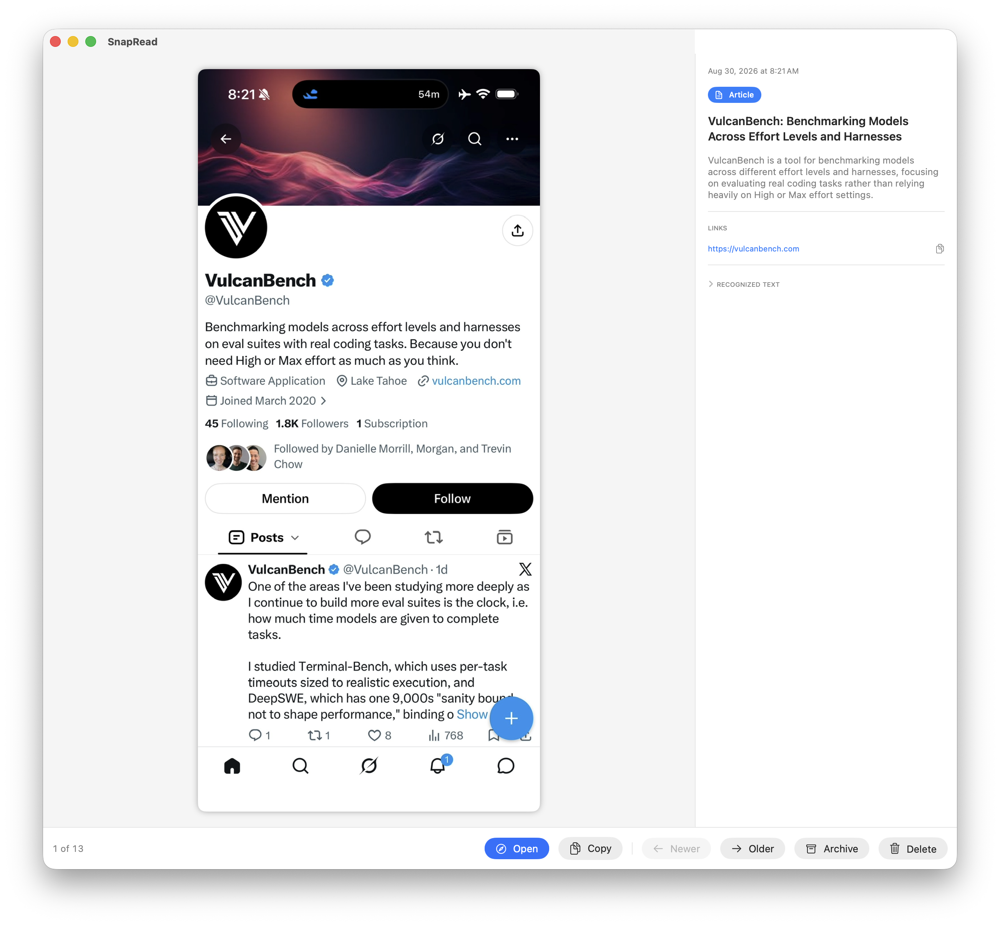

# SnapRead Mac Application

Your iPhone screenshots are an implicit to-do list — movies to watch, books to read, articles and tweets to check out. snapread turns that pile into something you can actually act on, then clean up.

This repo contains two implementations of the idea:

- **[SnapRead.app](#snapreadapp-macos)** — a native macOS triage app (the main event)
- **[snapread.py](#snapreadpy-python-proof-of-concept)** — the original Python CLI proof of concept

## SnapRead.app (macOS)

A native SwiftUI app that shows your recent iPhone screenshots one at a time, tells you what each one is (category, title, one-line summary), extracts any links, and lets you act: open the link, copy it, archive the screenshot, or delete it from your Photos library for real.



### How it works

Everything runs on-device; nothing leaves your Mac.

- **PhotoKit** fetches screenshot assets (`mediaSubtypes` contains `.photoScreenshot`) from a configurable recent window, downloading iCloud-only ones automatically with progress shown.
- **Vision** OCRs each screenshot; **NSDataDetector** extracts links — including the scheme-less `x.com/…` style URLs iOS apps display, which get upgraded to `https`.
- **Apple Foundation Models** (the on-device Apple Intelligence LLM) reads the OCR text and returns a structured interpretation: category (movie, book, article, social post, recipe, …), a short title, and a one-sentence summary. If Apple Intelligence is unavailable, it falls back to regex heuristics and labels the result "Basic analysis."
- The next few screenshots are prefetched and analyzed in the background, so advancing feels instant.

### Triage flow

One screenshot at a time, keyboard-first:

| Key            | Action                                               |
| -------------- | ---------------------------------------------------- |
| `→` / `Space`  | Older — move on without deciding, stays in the inbox |
| `←`            | Newer — go back to the more recent screenshot        |
| `A`            | Archive — done with it, photo is kept                |
| `⌫`            | Delete — mark for removal from Photos                |
| `Return` / `O` | Open the first link in your browser                  |
| `C`            | Copy the first link (`⇧C` copies the OCR text)       |
| `⌘Z`           | Undo the last archive or delete-mark                 |

Deletes don't interrupt you with a dialog per item: they're collected and applied automatically in **one batch** (a single system confirmation) when review reaches the end or when you quit the app. The end-of-queue screen also offers the batch action for retrying a cancelled or failed request. Deleted screenshots go to Photos' Recently Deleted and the deletion syncs to your iPhone via iCloud.

Triage decisions are persisted (`~/Library/Containers/org.cantoni.SnapRead/Data/Library/Application Support/SnapRead/triage.json`), so archived and deleted screenshots never reappear in the inbox. Skipped ones do, until you decide.

Settings (`⌘,`) control the lookback window (default: 30 days).

### Requirements

- macOS 26 (Tahoe) — uses the FoundationModels framework
- Apple Intelligence enabled, for AI interpretations (optional — falls back to heuristics)
- Xcode 26 and [XcodeGen](https://github.com/yonaskolb/XcodeGen) to build (`brew install xcodegen`)

### Building

The Makefile has most useful commands:

* make clean
* make debug
* make release

```bash
cd SnapRead
xcodegen generate
xcodebuild -project SnapRead.xcodeproj -scheme SnapRead -configuration Debug -derivedDataPath build build
open build/Build/Products/Debug/SnapRead.app
```

Grant **Full Access** when the Photos permission dialog appears. The `.xcodeproj` is generated from `project.yml` and not checked in.

Note: with no Developer ID configured, builds are ad-hoc signed, so macOS may re-ask for Photos permission after a rebuild.

## snapread.py (Python proof of concept)

The original CLI experiment that validated the idea. It reads the Photos SQLite database directly, OCRs cached screenshot derivatives with Apple Vision (via [ocrmac](https://github.com/straussmaximilian/ocrmac)), classifies content with regexes, optionally gets AI descriptions from a local [Ollama](https://ollama.com) `minicpm-v` model, and writes a terminal table plus JSON/HTML reports.


```bash
cd orig-python
pip install -r requirements.txt
python snapread.py                  # OCR + AI description (default)
python snapread.py --fast           # OCR only, no Ollama
python snapread.py --days 30 --output bookmarks.json
python snapread.py --fetch          # download iCloud-only screenshots before scanning
```

| Flag       | Default                | Description                                                     |
| ---------- | ---------------------- | --------------------------------------------------------------- |
| `--days`   | `7`                    | How many days back to scan                                      |
| `--output` | `snapread_output.json` | JSON output file path                                           |
| `--html`   | `snapread_output.html` | HTML output file path                                           |
| `--fetch`  | off                    | Download iCloud-only screenshots via Photos app before scanning |
| `--fast`   | off                    | Skip AI descriptions, use OCR only                              |
